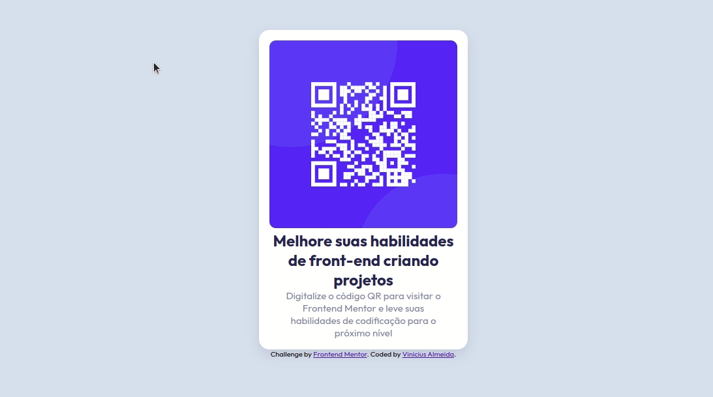

#  Frontend Mentor - solução de componente de código QR

Esta é uma solução para o [ desafio do componente de código QR no Frontend Mentor ](https://www.frontendmentor.io/challenges/qr-code-component-iux_sIO_H). Os desafios do Frontend Mentor ajudam você a melhorar suas habilidades de codificação criando projetos realistas.

##  Índice

- [ Visão geral ](#visão geral)
  - [ Captura de tela ](#captura de tela)
  - [ Links ](#links)

- [ Construído com ](#construído com)
- [ Autor ](#autor)

##  Visão geral
Replicar o design do desafio do componente de código QR do Frontend Mentor.

###  Captura de tela

###  Links

- URL da solução: [https://github.com/viniciusMaranhao/Qr-code-Front-End-Mentor-/]
- URL do site ao vivo: [https://viniciusmaranhao.github.io/Qr-code-Front-End-Mentor-/]

##  Construído com
- Marcação HTML5 semântica
- Propriedades personalizadas de CSS
- Flexbox

##  Autor
- Frontend Mentor - [ @viniciusMaranhao ](https://www.frontendmentor.io/profile/viniciusMaranhao)
